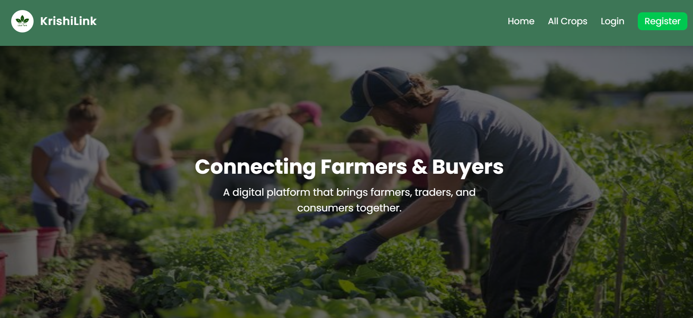

# KrishiLink 🌾

An online marketplace connecting farmers directly with buyers. Farmers can list their crops and buyers can browse and send interest requests for agricultural goods.

🌐 **Live Site:** [https://krishilink-zarin.netlify.app](https://krishilink-zarin.netlify.app)

---

## Screenshot



---

## Tech Stack


---

## Key Features

- **Farmer Crop Management** — Farmers can add, update, and delete crop listings with price, quantity, and location
- **Interest Request System** — Buyers can send interest requests with quantity and a custom message
- **Role-Based Access Control** — Farmers can't request their own crops; buyers limited to one interest per crop
- **Interest Management Dashboard** — Farmers can accept or reject received interest requests in real time
- **Firebase Authentication** — Secure login, registration, and logout
- **Fully Responsive** — Optimized for mobile, tablet, and desktop

---

## Dependencies

```json
"react"
"react-router-dom"
"tailwindcss"
"firebase"
"axios"
"express"
"mongodb"
"mongoose"
"cors"
"dotenv"
```

---

## Run Locally

### 1. Clone the repositories

```bash
git clone https://github.com/zarin-anjum/assignment-10-client
git clone https://github.com/zarin-anjum/assignment-10-server
```

### 2. Set up the client

```bash
cd assignment-10-client
npm install
```

Create a `.env` file in the client root:

```env
VITE_apiKey=your_firebase_api_key
VITE_authDomain=your_firebase_auth_domain
VITE_projectId=your_firebase_project_id
VITE_storageBucket=your_firebase_storage_bucket
VITE_messagingSenderId=your_firebase_messaging_sender_id
VITE_appId=your_firebase_app_id
VITE_SERVER_URL=http://localhost:5000
```

```bash
npm run dev
```

### 3. Set up the server

```bash
cd assignment-10-server
npm install
```

Create a `.env` file in the server root:

```env
DB_USER=your_mongodb_user
DB_PASS=your_mongodb_password
```

```bash
node index.js
```

---

## Relevant Links

- 🌐 [Live Site](https://krishilink-zarin.netlify.app)
- 💻 [Client Repo](https://github.com/zarin-anjum/assignment-10-client)

